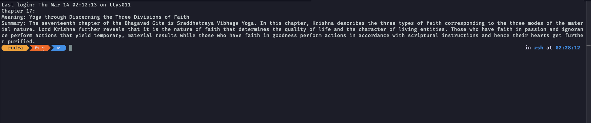

# Bhagavad Gita Summary

### Install

You can use go install command

```console
go install github.com/rudSarkar/bhagavadgitaapi
```

then use command `bhagavadgitaapi` to get the output

or you can simply clone this project modify according your need and then build

```console
go build -o gita-summary main.go
```

You can use it inside `~/.zshrc`. If you are following first installation system then add `bhagavadgitaapi` at the end of `~/.zshrc`

```bash
# other contents above
bhagavadgitaapi
```

If you are using manual method 'second step`copy the to any`bin`location on your system and add the binary to`~/.zshrc` at the end

```bash
# other contents above
gita-summary
```

### Demo



Thanks [Bhagavad Gita API](https://bhagavadgitaapi.in/) for data.
